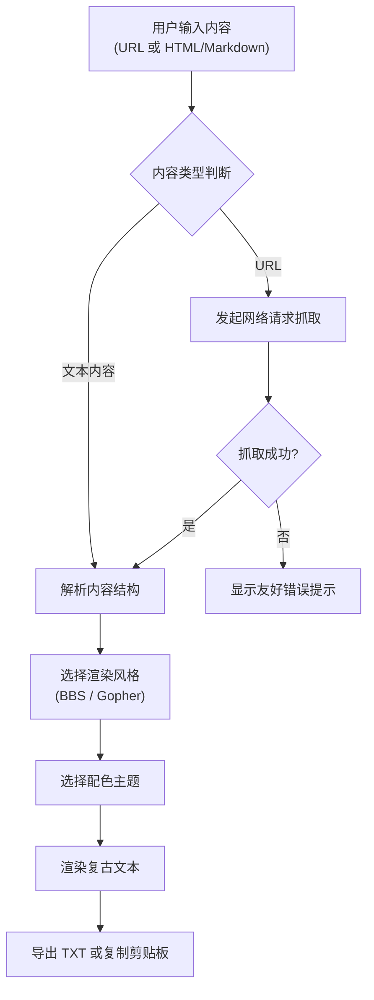

## 1. 产品概述

复古网页渲染器是一款将现代网页内容以 BBS 或 Gopher 等复古终端风格重新排版展示的前端工具。用户可以输入网址或直接粘贴 HTML/Markdown 内容，体验上世纪 80-90 年代的文本界面美学。

- 主要用途：怀旧体验、无障碍阅读、内容去噪、复古艺术创作
- 目标用户：复古科技爱好者、文本内容创作者、怀旧网民
- 产品价值：让现代互联网内容重现经典终端的独特魅力

## 2. 核心功能

### 2.1 功能模块

1. **输入页面**：URL 输入框、HTML/Markdown 文本输入区、抓取按钮
2. **渲染展示区**：实时预览渲染结果、滚动查看
3. **控制面板**：风格切换（BBS/Gopher）、配色主题切换、导出按钮

### 2.2 页面详情

| 页面名称 | 模块名称 | 功能描述 |
|-----------|-------------|---------------------|
| 主页面 | 输入模块 | 支持 URL 输入和 HTML/Markdown 粘贴，一键抓取或渲染 |
| 主页面 | 渲染预览区 | 大尺寸等宽字体展示区，支持滚动，复古终端外观 |
| 主页面 | 控制面板 | 风格切换、主题配色、导出 TXT、复制到剪贴板 |

## 3. 核心流程

用户流程说明：
1. 用户在输入区选择输入方式（URL 或粘贴内容）
2. 点击渲染按钮后，系统先获取/解析内容
3. 用户可随时切换渲染风格和配色主题
4. 渲染结果实时更新展示
5. 支持将最终结果导出为文本文件或复制到剪贴板

## 4. 用户界面设计

### 4.1 设计风格

**整体风格**：复古终端美学，致敬 80-90 年代 BBS 与 Gopher 时代

- **主色调**：深邃的黑色背景，配合荧光色文本
- **配色主题**（可切换）：
  - 绿磷光：经典 `#33FF33` 绿色文字 + 黑色背景
  - 琥珀屏：暖橙色 `#FFB000` 文字 + 深棕色背景
  - 蓝白：`#ADD8E6` 淡蓝文字 + 深蓝背景
  - 黑白：高对比度白色文字 + 纯黑背景
- **字体**：等宽字体（如 `Courier New`、`Consolas`、`Monaco`）
- **按钮风格**：3D 凸起效果，按下时凹陷，边框清晰
- **布局**：顶部输入区 + 中部控制面板 + 底部大区域渲染预览

### 4.2 页面设计概述

| 页面名称 | 模块名称 | UI 元素 |
|-----------|-------------|-------------|
| 主页面 | 输入模块 | 标签页切换（URL/文本）、大输入框、带 ASCII 装饰的按钮 |
| 主页面 | 控制面板 | 风格切换按钮组、配色主题下拉、导出操作按钮组 |
| 主页面 | 渲染预览区 | 带 CRT 扫描线效果的文本区域、ASCII 边框装饰、滚动条美化 |

**BBS 风格元素**：
- ASCII 字符画标题（`╔══════════╗` 风格边框）
- 大色块高亮标题栏
- 链接转换为带编号的菜单项：`[1] 链接文字`
- 段落间使用 `──────────` 或 `══════════` 分隔线
- 列表使用 `•` 或 `*` 符号

**Gopher 风格元素**：
- 极简目录列表格式
- 每条目前面带类型图标：
  - `📄` 文本文件
  - `🔗` 链接
  - `📁` 目录/区块
  - `🖼️` 图片
  - `📋` 列表项
- 统一左对齐，无多余装饰

### 4.3 响应式设计

- **桌面优先**：主渲染区占据主要空间，适合长时间阅读
- **移动端适配**：输入区和控制面板可折叠，渲染区保持全屏宽度
- **触控优化**：按钮尺寸增大，适合触控操作

### 4.4 视觉特效

- CRT 扫描线叠加效果（可开关）
- 文字轻微闪烁动画（模拟老式显示器）
- 屏幕四角轻微暗角效果
- 按钮按下时的机械反馈动画
