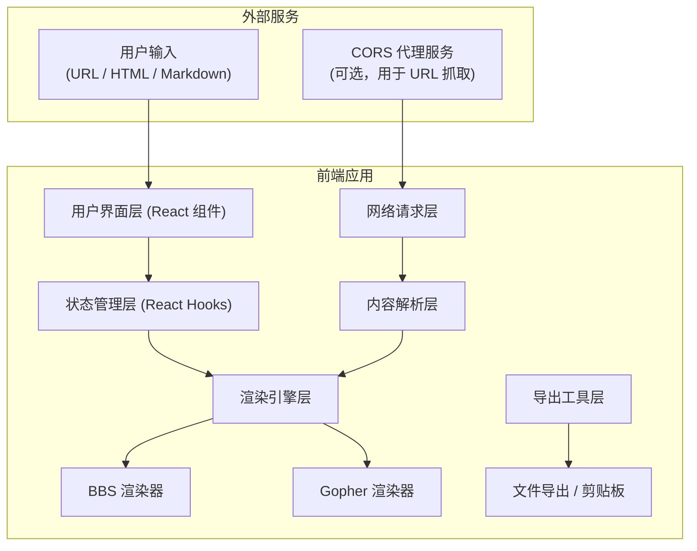
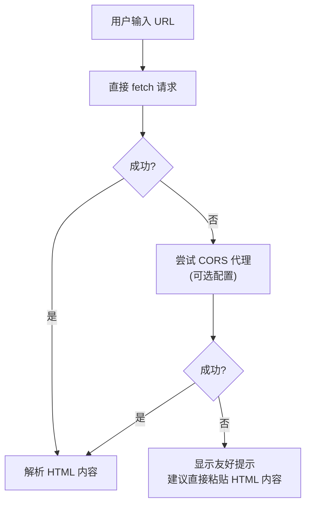

## 1. 架构设计



## 2. 技术描述

- **前端框架**：React@18 + TypeScript
- **构建工具**：Vite@5
- **样式方案**：TailwindCSS@3 + CSS 变量（主题切换）
- **HTML 解析**：`cheerio`（轻量级 jQuery 风格解析器）
- **Markdown 解析**：`marked` 或自定义简单解析器
- **网络请求**：`fetch` API + 可选 CORS 代理
- **图标方案**：Unicode Emoji（保持复古风格，不引入图标库）

**核心技术决策**：
1. 纯前端实现，无需后端服务
2. URL 抓取使用浏览器 fetch，失败时提示用户使用代理或直接粘贴内容
3. 渲染结果为纯文本，便于复制和导出

## 3. 目录结构

```
src/
├── components/
│   ├── InputPanel.tsx      # 输入面板（URL/文本切换）
│   ├── ControlPanel.tsx    # 控制面板（风格/主题/导出）
│   ├── RenderView.tsx      # 渲染预览区
│   └── TerminalFrame.tsx   # 终端外框装饰
├── engines/
│   ├── types.ts            # 类型定义
│   ├── parser.ts           # HTML/Markdown 解析器
│   ├── bbsRenderer.ts      # BBS 风格渲染引擎
│   └── gopherRenderer.ts   # Gopher 风格渲染引擎
├── hooks/
│   ├── useContentFetch.ts  # 内容获取 Hook
│   └── useTerminalTheme.ts # 主题切换 Hook
├── utils/
│   ├── export.ts           # 导出工具函数
│   └── ascii.ts            # ASCII 字符画工具
├── themes/
│   └── terminal.css        # 终端主题 CSS 变量
├── App.tsx
├── main.tsx
└── index.css
```

## 4. 核心类型定义

```typescript
// 渲染风格
export type RenderStyle = 'bbs' | 'gopher';

// 终端主题
export type TerminalTheme = 'green' | 'amber' | 'blue' | 'mono';

// 内容类型
export type ContentType = 'url' | 'html' | 'markdown';

// 解析后的内容节点
export interface ContentNode {
  type: 'heading' | 'paragraph' | 'link' | 'list' | 'listItem' | 'image' | 'block' | 'code';
  level?: number; // 标题层级
  text: string;
  href?: string;
  children?: ContentNode[];
}

// 主题配置
export interface ThemeConfig {
  name: string;
  bg: string;
  text: string;
  accent: string;
  dim: string;
  border: string;
}

// 渲染结果
export interface RenderResult {
  text: string;
  lines: string[];
  linkMap: Map<number, string>; // BBS 风格链接编号映射
}
```

## 5. 主题配置

| 主题名称 | 背景色 | 文字色 | 强调色 | 暗色 | 边框色 |
|---------|--------|--------|--------|------|--------|
| 绿磷光 (green) | `#000000` | `#33FF33` | `#00FF00` | `#006600` | `#33FF33` |
| 琥珀屏 (amber) | `#1A0F00` | `#FFB000` | `#FFD700` | `#664400` | `#FFB000` |
| 蓝白 (blue) | `#001A33` | `#ADD8E6` | `#FFFFFF` | `#336699` | `#ADD8E6` |
| 黑白 (mono) | `#000000` | `#FFFFFF` | `#CCCCCC` | `#666666` | `#FFFFFF` |

## 6. 核心算法

### 6.1 HTML 解析流程
1. 使用 `cheerio` 加载 HTML 字符串
2. 提取 `<title>`、`<h1>-<h6>`、`<p>`、`<a>`、`<ul>/<ol>/<li>`、`` 等语义标签
3. 忽略 `<script>`、`<style>`、`<nav>`、`<footer>` 等非内容标签
4. 按 DOM 顺序转换为 `ContentNode` 树结构

### 6.2 Markdown 解析流程
1. 按行分割 Markdown 文本
2. 识别标题（`#` 开头）、列表（`-`/`*`/`1.` 开头）、链接（`[text](url)`）
3. 转换为统一的 `ContentNode` 结构

### 6.3 BBS 渲染算法
1. 遍历 `ContentNode` 树
2. 标题：生成 ASCII 边框 + 大色块反转显示
3. 段落：按 80 字符宽度自动换行
4. 链接：收集所有链接，分配唯一编号，显示为 `[n] 链接文字`
5. 分隔线：段落间插入 `══════════` 或 `──────────`
6. 列表：使用 `•` 或 `*` 符号前缀

### 6.4 Gopher 渲染算法
1. 遍历 `ContentNode` 树
2. 每个内容节点前添加类型图标（📄/🔗/📁/🖼️/📋）
3. 标题使用大写并添加下划线（`=` 字符）
4. 保持极简左对齐，无多余装饰
5. 链接显示为 `🔗 描述  (URL)`

## 7. URL 抓取策略

由于浏览器同源策略限制，URL 抓取采用以下降级策略：



**错误提示示例**：
```
╔══════════════════════════════════════════════════════════════╗
║  ⚠️  无法抓取该网页                                           ║
╠══════════════════════════════════════════════════════════════╣
║  可能的原因：                                                 ║
║  • 目标网站禁止跨域访问 (CORS policy)                        ║
║  • 网络连接问题                                              ║
║  • URL 地址无效                                              ║
║                                                             ║
║  解决方案：                                                   ║
║  1. 直接复制网页的 HTML 源码粘贴到下方文本框                  ║
║  2. 使用浏览器保存网页为 .html 文件后上传                     ║
║  3. 尝试使用支持 CORS 的代理服务                             ║
╚══════════════════════════════════════════════════════════════╝
```
